---
班级：网安2002班
学号：U202012043
姓名：范启航
---

# 菁英班作业第6课

对AssaultCube进行攻击，实现透视、自瞄类的作弊功能。

本作业实现了两种透视功能，一种自瞄功能。

## 一、搜索基本数据偏移地址

本作业所需的各项数据偏移地址如下。

>// 结构体偏移信息
>
>#define entityListOffset (0x58AC04)
>
>#define viewMatrixOffset (0x57DFD0)
>
>#define playerBaseOffset (0x58AC00)
>
>#define amountOfPlayersOffset (0x0058AC0C)
>
>// 实体结构偏移信息
>
>#define healthOffset (0xEC)
>
>#define locationXOffset (0x28)
>
>#define locationYOffset (0x2C)
>
>#define locationZOffset (0x30)
>
>#define headXOffset (0x4)
>
>#define headYOffset (0x8)
>
>#define headZOffset (0xC)
>
>#define teamOffset (0x30c)
>
>#define yawOffset (0x34)
>
>#define pitchOffset (0x38)
>
>#define nameOffset (0x205)

后面只展示几个相对较难，较为重要的地址寻找过程

### 1、玩家基地址、基本属性寻找。

首先选择寻找的血量这一可控，已知数值。

血量为100时，搜索值为100的数值，结果如下：

使血量减为96，继续搜索，结果如下

搜索到唯一数值，即为结果。

但此地址为动态加载的，每次启动时不同，需要查找其静态存储位置。

查看哪些代码访问了该地址。如下代码访问了该地址。

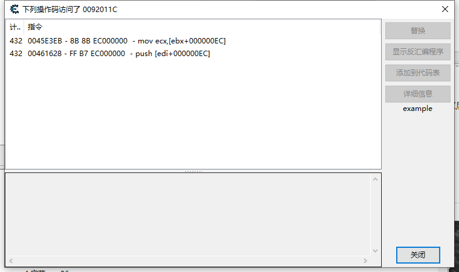

其中存在ebx+0xEC，判断血量位于0xEC偏移地址。ebx中存放玩家基地址。

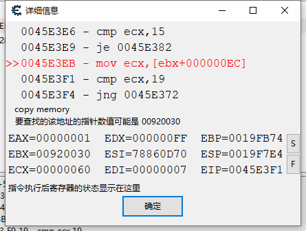

玩家基地址为0x920030。

在内存中搜索何处存放有0x920030。

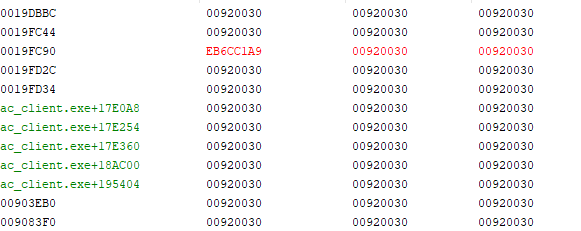

如下五个绿色的为静态地址。初步判断均为玩家基地址。

初步选择0x58AC00(基地址0x400000+0x18AC00)地址。

重启游戏后该地址未变。

下面查找玩家名称位置，玩家名称位于unarmed

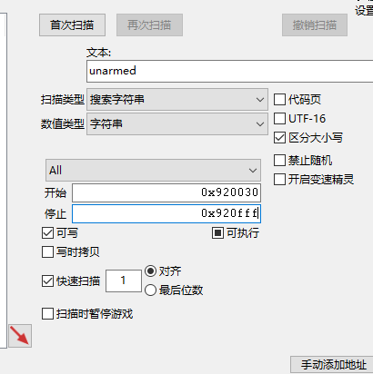

在玩家基地址后面一部分区域内搜索该字符串。

搜索到唯一结果。

其偏移为0x205。

玩家其他属性如脚的坐标，头的坐标，视角等数据可同上面方法搜索。

### 2、实体（bot）列表查找

通过姓名搜索，进而找到实体存储位置与实体列表存储位置

搜索姓名为Zeunerts的敌人

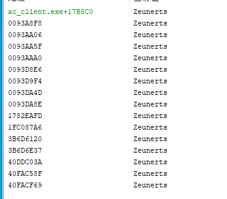

查看静态地址处

其附近地址处均为姓名字符串，判断此处存储机器人姓名，无作用。

查看其他地址有哪些代码访问了

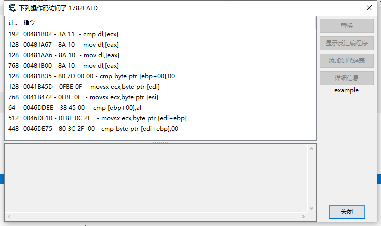

0x1782EAFD。

选择某一处汇编指令，如481B02附加的汇编指令

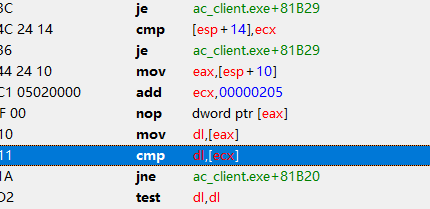

ecx即为字符串存放地址。

add ecx, 0x205。

初步判断ecx一开始存放有实体基地址，205为名称的偏移。

实体基地址为0x1782e8f8。

而玩家的名称偏移恰好也为0x205，也可判断玩家与实体具有相同的结构。

上面一部分代码，有esi * 4。

类似于指针数组的遍历，初步判断[ebx]为实体列表的基地址。

实体列表指针存放地址为0x58AC04。其值为0x1B0BF2A0。

地址0x1B0BF2A0处数据如下。

数组第一个值为0，空值，符合设计习惯。

查看第五个指针0x1782E8F8,恰好为前面找到的名为Zeunerts的实体的基地址。故此判断正确。

因此寻找到存放实体列表地址的指针位于0x58AC04处。访问其地址即可找到实体列表，遍历该列表中的指针，即可找到所有实体对象。

### 3、寻找玩家的矩阵信息

后面透视需要用到该矩阵信息。

矩阵具有一些特征，可以依据这些特征进行搜索，其特征略。下面只叙述查找方法。

首先搜索-1到1的浮点数据。

搜索到的结果较多，接下来通过改变位置，矩阵改变。位置姿态不变，矩阵不变，进行继续搜索筛选

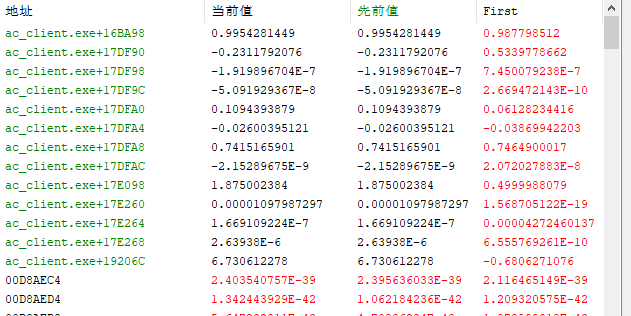

最终剩下约183个数据。

而矩阵一般位于固定地址区域内，因此对绿色的固定地址区域进行搜索。

该4X4矩阵满足以下三个特征：

1. 跳动时，3个数据变动
2. 晃动鼠标时，一个数据保持0不动
3. 存在3对两两相同

故该地址0x57DFD0为矩阵存放地址。

### 4、其余信息搜索

同上述方法即可找到所有所需信息。

## 二、通过矩阵实现透视

### 1、更新所有实体的信息与矩阵

注入的线程中，每次循环更新所有实体的信息

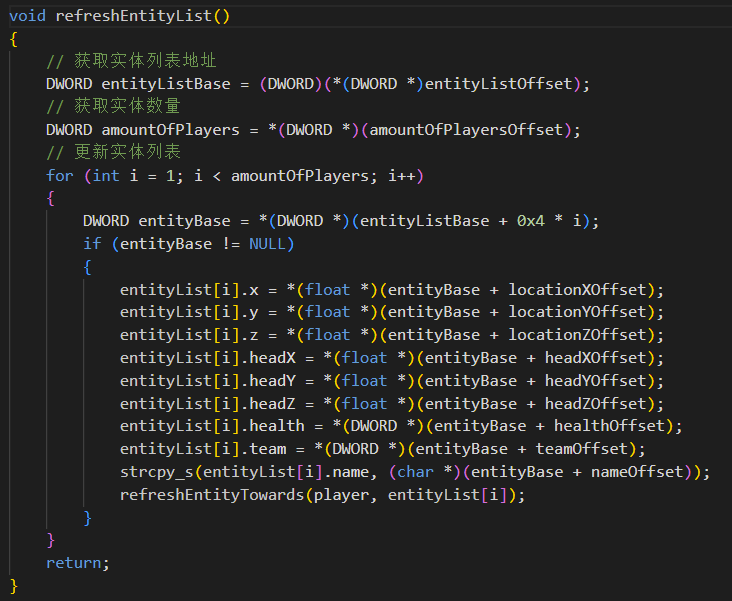

更新矩阵的信息

### 2、通过矩阵3D坐标转2D坐标

利用如下函数将实体的头部坐标，脚坐标转为视野中的二维坐标

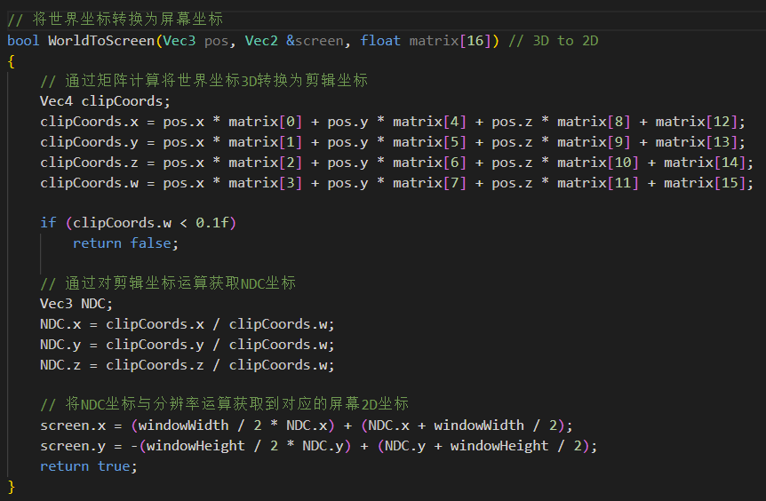

首先通过矩阵乘法获取剪辑坐标

> 剪辑坐标 x = a0*x +a4*y + a8*z + a12*w
> 剪辑坐标 y = a1*x +a5*y + a9*z + a13*w
> 剪辑坐标 z = a2*x +a6*y + a10*z + a14*w
> 剪辑坐标 w = a3*x +a7*y + a11*z + a15*w

再通过剪辑坐标运算得到NDC坐标。

矩阵的设计中w 是可以让剪辑坐标范围到-1和1的 也就成了NDC坐标

所以NDC坐标很好理解,就是 -1到1的平面坐标系   中心点为0,0

> NDC .x = 剪辑坐标 x/剪辑坐标 w
> NDC.y =剪辑坐标y/剪辑坐标 w
> NDC.z =剪辑坐标z/剪辑坐标 w

在将NDC坐标转换为屏幕中的二维坐标。

若实体不在视野内，该函数返回false。

### 3、通过2D坐标绘制矩形方块与血量

绘制人物方框、血量和线。

## 三、不通过矩阵实现透视

### 1、更新玩家与所有实体信息

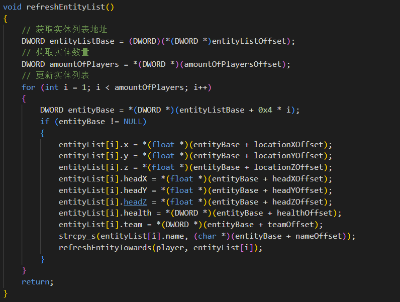

需要获取玩家的坐标，水平视角，垂直视角。

还需要获取实体的坐标，头部坐标，相对于玩家的水平视角，水平视角差，垂直视角，垂直视角差。

### 2、通过坐标将3D坐标转换为2D坐标

利用如下函数将实体的头部坐标，脚坐标转为视野中的二维坐标

若不在可视范围内则直接返回false。

### 3、通过2D坐标绘制矩形方块与血量

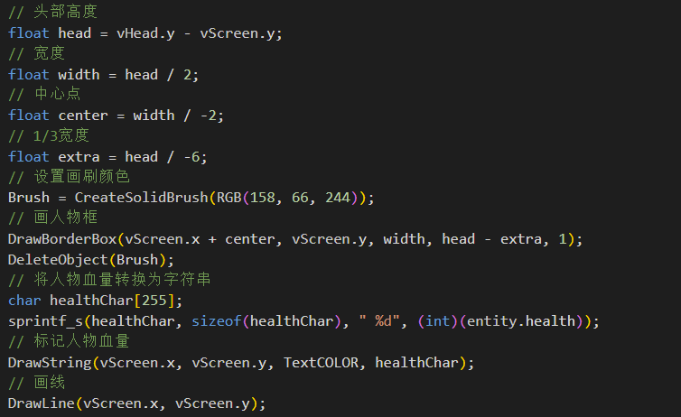

由于获取了头部2D坐标与躯干2D坐标，同上方法绘制矩形，血量与线。

## 四、实现自瞄

### 1、更新玩家与实体信息

同上。

### 2、计算离玩家鼠标最近的敌人。

通过遍历实体列表，计算在画面中距离玩家视角水平方向上最近的敌人。

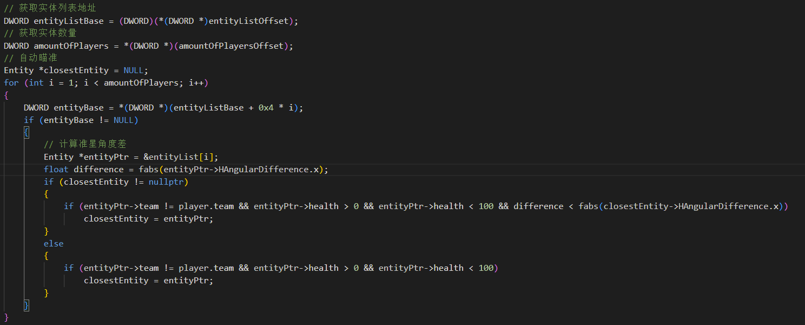

### 3、调整玩家视角

若最近的敌人存活，则将玩家视角强制修改为敌人方向，实现自瞄

函数如下：

#### 4、细节调整

此功能可设置为玩家左键设计时再锁定敌人头部，实现更优良的体验。

## 五、注入DLL

### 1、编译DLL

### 2、使用注射器注入DLL

## 六、测试

### 1、F1:锁血

按下F1后，血量锁定并修改

### 2、F2:透视(矩阵)

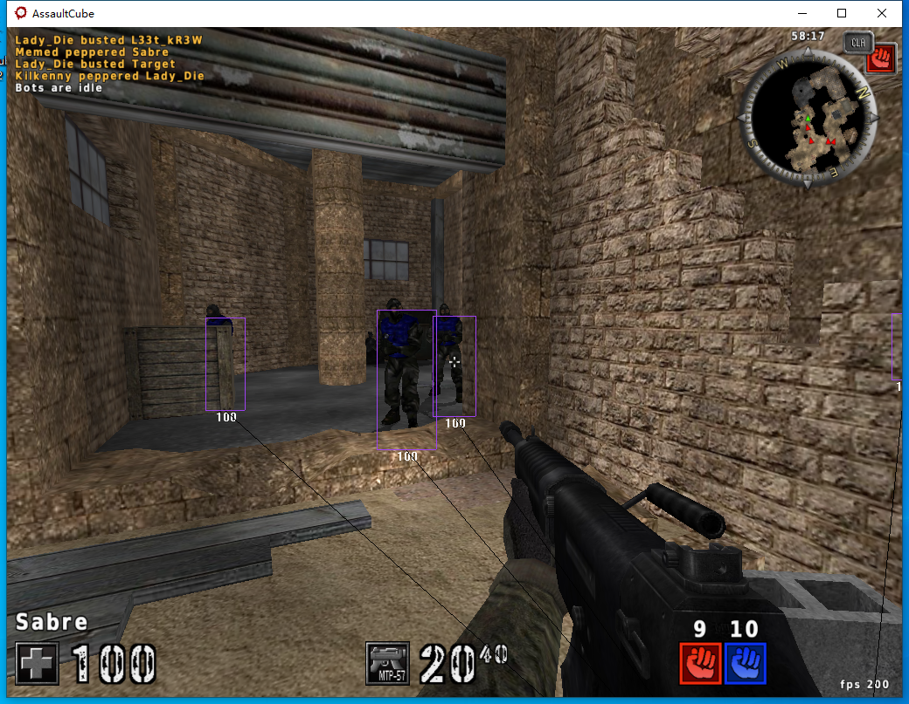

### 3、F3:透视(非矩阵)

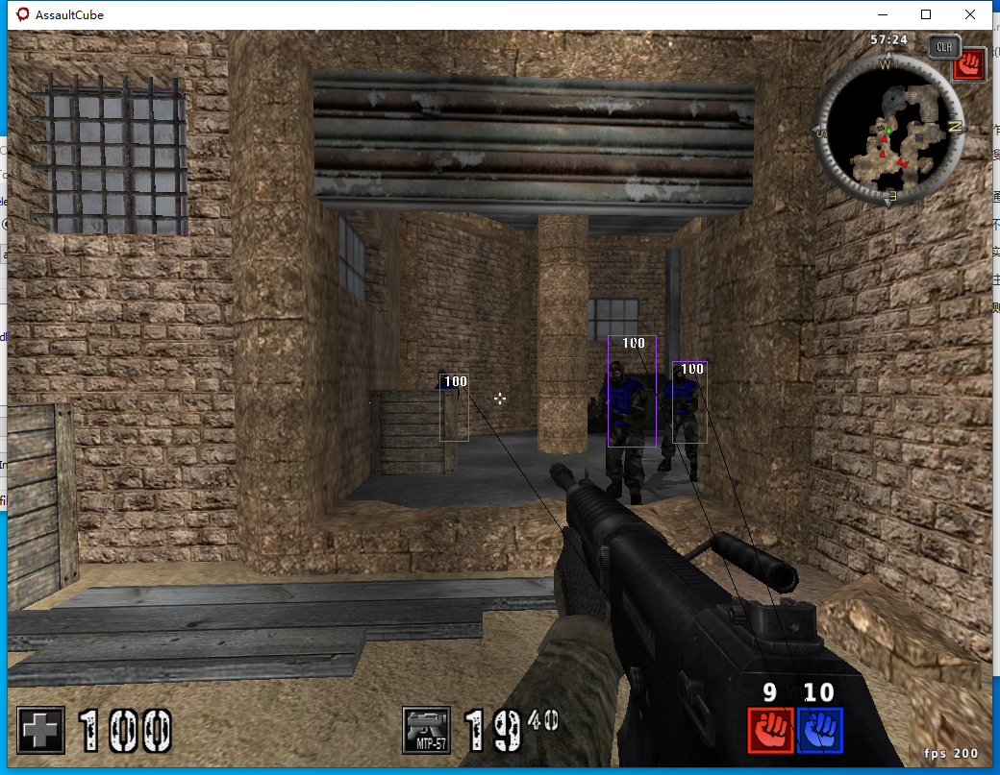

效果较差

### 4、F4自瞄

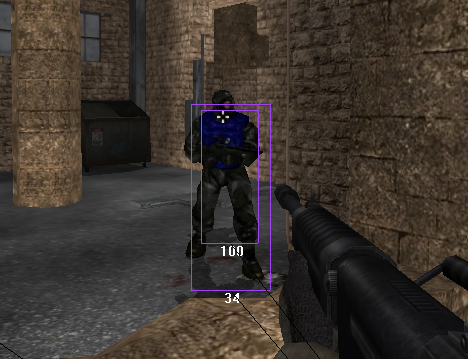

自动瞄准头部
